<picture><source media="(max-width: 520px) and (prefers-color-scheme: dark)" srcset="./assets/header-signal18-mobile-dark.svg"><source media="(max-width: 520px) and (prefers-color-scheme: light)" srcset="./assets/header-signal18-mobile-light.svg"><source media="(prefers-color-scheme: dark)" srcset="./assets/header-signal18-dark.svg"><source media="(prefers-color-scheme: light)" srcset="./assets/header-signal18-light.svg"></picture>

### <picture><source media="(prefers-color-scheme: dark)" srcset="./assets/experience-dark.svg"><source media="(prefers-color-scheme: light)" srcset="./assets/experience-light.svg"></picture> &nbsp; Experience

- **DeepWisdom** · Research Engineer Intern · Jul 2025 — Aug 2026
- **HKUST (Guangzhou)** · Research Assistant · Dec 2025 — Feb 2026

---

### <picture><source media="(prefers-color-scheme: dark)" srcset="./assets/publications-dark.svg"><source media="(prefers-color-scheme: light)" srcset="./assets/publications-light.svg"></picture> &nbsp; Publications

- [AutoWebWorld: Synthesizing Infinite Verifiable Web Environments via Finite State Machines](https://arxiv.org/pdf/2602.14296) &nbsp; <picture><source media="(prefers-color-scheme: dark)" srcset="./assets/icml-2026-dark.svg"><source media="(prefers-color-scheme: light)" srcset="./assets/icml-2026-light.svg"></picture>
- [AOrchestra: Automating Sub-agent Creation for Agentic Orchestration](https://arxiv.org/pdf/2602.03786) &nbsp; <picture><source media="(prefers-color-scheme: dark)" srcset="./assets/icml-2026-dark.svg"><source media="(prefers-color-scheme: light)" srcset="./assets/icml-2026-light.svg"></picture>
- [Harnessing Agentic Evolution](https://arxiv.org/pdf/2605.13821) &nbsp; <picture><source media="(prefers-color-scheme: dark)" srcset="./assets/neurips-2026-dark.svg"><source media="(prefers-color-scheme: light)" srcset="./assets/neurips-2026-light.svg"></picture>
- [DeepEye: A Steerable Self-driving Data Agent System](https://dl.acm.org/doi/pdf/10.1145/3788853.3801612) &nbsp; <picture><source media="(prefers-color-scheme: dark)" srcset="./assets/sigmod-2026-dark.svg"><source media="(prefers-color-scheme: light)" srcset="./assets/sigmod-2026-light.svg"></picture>
- [Reasoning via Video: The First Evaluation of Video Models' Reasoning Abilities through Maze-Solving Tasks](https://arxiv.org/pdf/2511.15065)
- [AutoEnv: Automated Environments for Measuring Cross-Environment Agent Learning](https://arxiv.org/pdf/2511.19304)
- [Trainable Dynamic Mask Sparse Attention](https://arxiv.org/pdf/2508.02124)
- [Foundation Protocol: A Coordination Layer for Agentic Society](https://arxiv.org/pdf/2605.23218)

---

<picture><source media="(prefers-color-scheme: dark)" srcset="./assets/code-dark.svg"><source media="(prefers-color-scheme: light)" srcset="./assets/code-light.svg"></picture> &nbsp; Python · Java · JavaScript &nbsp; / &nbsp; Flask · Spring · Vue
