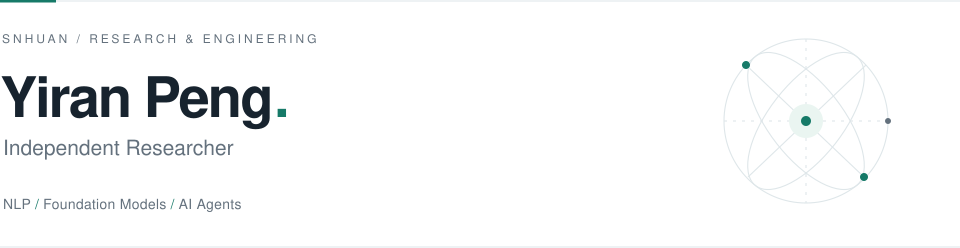

<picture>
  <source media="(prefers-color-scheme: dark)" srcset="./assets/header-dark.svg">
  <source media="(prefers-color-scheme: light)" srcset="./assets/header-light.svg">
  
</picture>

 

My research interests span **natural language processing**, **large language models**, **foundation models**, and **AI agents**.

### Experience

- **DeepWisdom** · Research Engineer Intern   Jul 2025 — Aug 2026
- **HKUST (Guangzhou)** · Research Assistant   Dec 2025 — Feb 2026

### Publications

**[AutoWebWorld](https://arxiv.org/pdf/2602.14296)** &nbsp; ICML 2026  
Synthesizing infinite verifiable web environments via finite state machines.

**[AOrchestra](https://arxiv.org/pdf/2602.03786)** &nbsp; ICML 2026  
Automating sub-agent creation for agentic orchestration.

**[Harnessing Agentic Evolution](https://arxiv.org/pdf/2605.13821)** &nbsp; NeurIPS 2026

**[DeepEye](https://dl.acm.org/doi/pdf/10.1145/3788853.3801612)** &nbsp; SIGMOD 2026 · Demo  
A steerable self-driving data agent system.

More research · 4 papers

- [Reasoning via Video: The First Evaluation of Video Models' Reasoning Abilities through Maze-Solving Tasks](https://arxiv.org/pdf/2511.15065)
- [AutoEnv: Automated Environments for Measuring Cross-Environment Agent Learning](https://arxiv.org/pdf/2511.19304)
- [Trainable Dynamic Mask Sparse Attention](https://arxiv.org/pdf/2508.02124)
- [Foundation Protocol: A Coordination Layer for Agentic Society](https://arxiv.org/pdf/2605.23218)

### Toolkit & beyond

**Code** &nbsp; Python · Java · JavaScript  
**Frameworks** &nbsp; Flask · Spring · Vue  
**Writing** &nbsp; Markdown  
**Languages** &nbsp; 简体中文 · 日本語 · English

Beyond research, I enjoy building software, apps, mini programs, and Minecraft servers, and exploring game production, game soundtracks, and VFX.

---

[Explore my repositories ↗](https://github.com/SNHuan?tab=repositories)
